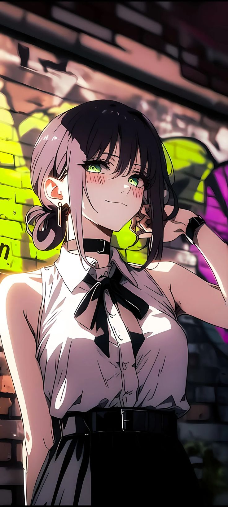
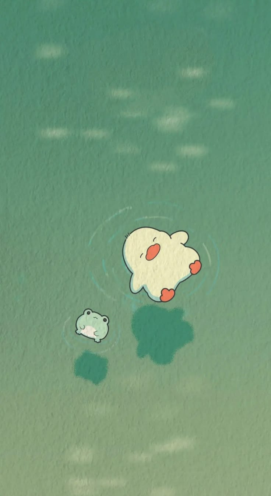
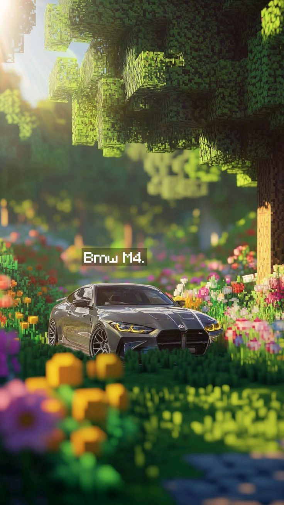
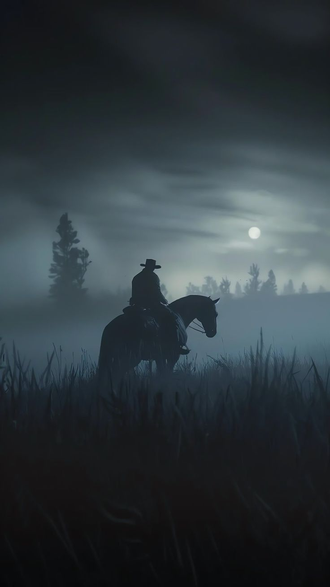

  

<h2 align="center">FireWalls</h2>

|A curated collection of aesthetic desktop and mobile wallpapers. 
|Anime • Minimal • Cyberpunk • Nature • Cozy • Dark • Clean setups

  
  
  

## 🌌 Preview

<table>
  <tr>
    <td width="50%" valign="top">

<h3 align="center">🖥️ Desktop Wallpapers</h3>

 

    </td>

    <td width="50%" valign="top">

<h3 align="center">📱 Mobile Wallpapers</h3>

 

    </td>
  </tr>
</table>

---

## ✨ About

**FireWalls** is my personal collection of wallpapers gathered over the years.
A mix of clean desktops, anime aesthetics, moody skies, terminal vibes, cozy scenes, and wallpapers that simply look too good to ignore.

New wallpapers will be added often.

---

## 🖥️ Desktop Wallpapers

High quality wallpapers for:

* PCs
* Minimal desktops
* Anime & aesthetic setups

📁 Browse here →  [Desktop Wallpapers](./Desktop/Wallpapers)

---

## 📱 Mobile Wallpapers

Wallpapers optimized for:

* Anime themes
* Clean minimal homescreens
* Dark & aesthetic vibes

📁 Browse here → [Mobile Wallpapers](./Mobile)

---

### ⚠️ About this collection

This is my personal wallpaper collection that I’ve been curating over time.

Some of these wallpapers come from different places across the internet and social platforms.

If you’re the original artist and want credit or removal, feel free to reach out — I’ll fix it right away.

Big respect to all the creators out there. I’m just collecting things I genuinely like.

---

## ⭐ Support

If you found a wallpaper you liked, consider **starring the repo**.
It helps more people discover cool wallpapers.
I'll organise the wallpapers into categories very soon ✌️
