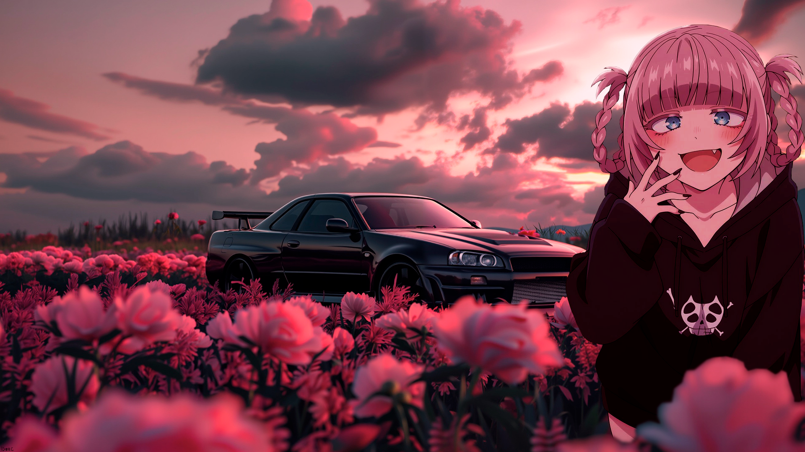
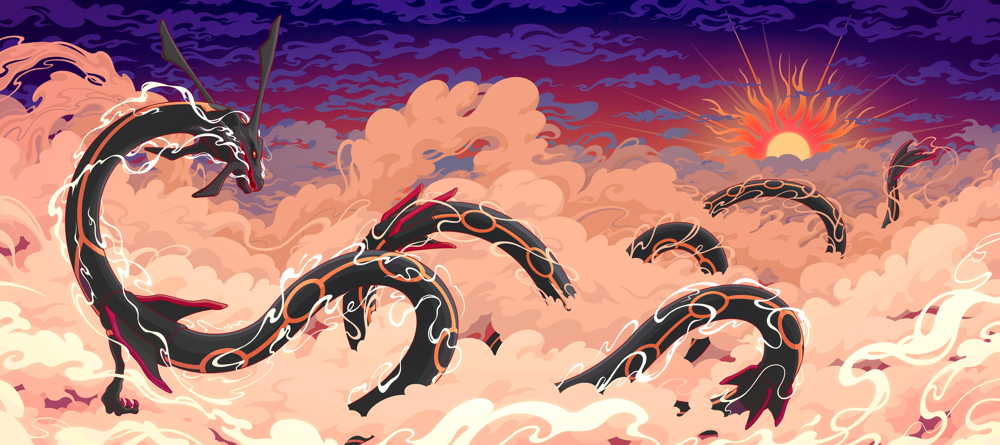
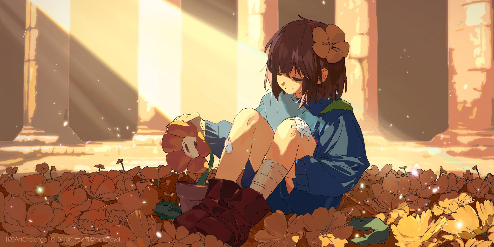

  

<h1 align="center">FireWalls</h1>

  A curated collection of aesthetic desktop and mobile wallpapers. 
  <b>Anime • Minimal • Cyberpunk • Nature • Cozy • Dark • Clean setups</b>

  
  
  
  
  

---

  

---

## 🌌 Preview

<table align="center">
  <tr>
    <td></td>
    <td></td>
  </tr>
  <tr>
    <td></td>
    <td></td>
  </tr>
</table>

---

## ✨ About

**FireWalls** is my personal collection of wallpapers gathered over time.  
A mix of clean desktops, anime aesthetics, moody skies, terminal vibes, cozy scenes, and wallpapers that just look too good to ignore.

New wallpapers will be added often.

👉 For a smoother browsing experience, check out the web version above.

---

## 📱 Mobile Wallpapers

Wallpapers optimized for:

* Anime themes
* Clean home screens
* Dark & aesthetic vibes

📁 Browse here → [Mobile Wallpapers](./Mobile)

---

## 🌐 Explore Wallpapers Online

If you want more wallpapers than what's in this repo, I built a web app for FireWalls.

✨ Browse, preview, and discover wallpapers instantly  
📱 Works on mobile + desktop  
⚡ Faster updates than the repo  
🪷 Wallhaven, but with extra style

👉 **Open FireWalls Web App:** [firewalls-engine.vercel.app](https://firewalls-engine.vercel.app/)

---

## ⚠️ Disclaimer & Credits

This is a personal wallpaper collection curated over time. Some wallpapers come from various places across the internet and social platforms.

If you're the original artist and want credit or removal, feel free to reach out — it will be handled quickly.

Big respect to all creators! This repo is simply a collection of art I genuinely admire.

---

## ⭐ Support

If you found something you like, consider giving the repo a star ⭐  
It helps more people discover it!

More categories and organization coming soon ✌️
